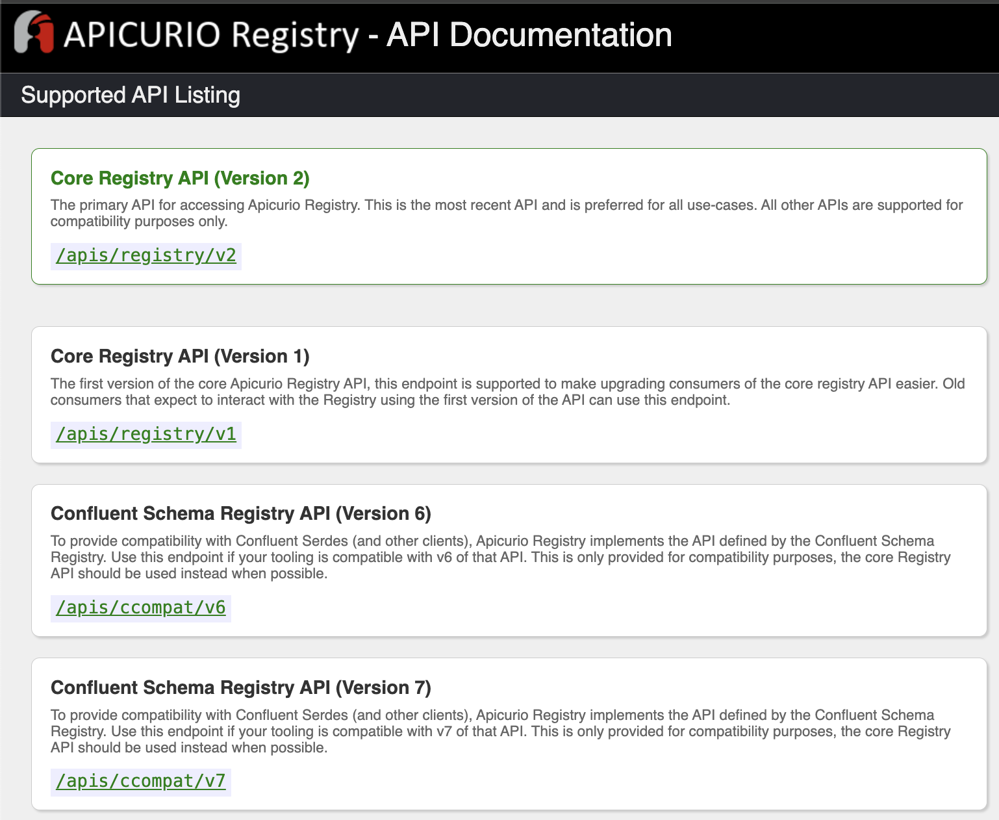

# kubernetes에서 kafka 활용하기

## Table of Contents
- [Overview](#overview)
- [kafka 설치](#kafka-설치)
- [관리 도구 설치](#관리-도구-설치)
  - [postgresql](#postgresql) (optional)
  - [odd-platform](#odd-platform)
  - [kafka ui](#kafka-ui)
- [모니터링 도구 설치](#모니터링-도구-설치)
- [cdc 예제](#cdc-예제)

## Overview

본 프로젝트는 Cloud Native Korea Community Day 2024에서 시연을 하기 위해서 작성되었다.   
프로젝트에서는 다음과 같은 동작의 예제를 보여준다.   
> strimzi operator를 활용한 kafka, kafka connect 설치   
> kafka 관리 주변 도구 설치(helm chart)   
> kafka 모니터링 통합(prometheus, kafka exporter, grafana)   


## kafka, kafka connect 설치

strimzi operator는 다음 링크를 참고한다.   
[strimzi - operator component overview](https://strimzi.io/docs/operators/latest/overview#overview-components_str)   
[strimzi - deploy kakfa](https://strimzi.io/docs/operators/latest/deploying#con-deploy-paths-str)   
[operatorhub](https://operatorhub.io/operator/strimzi-kafka-operator)   

```yaml
kubectl apply -f ./operators/strimzi
kubectl apply -f ./crds/kafka/kafka.yaml
kubectl apply -f ./crds/kafka/kafka-connect-build.yaml
```
### 설명
kafka, kafka connect, connector 등을 설치하기 위해서는 먼저 strimzi operator를 설치한다.   
이후 crd(custom resource definition)을 생성하면 operator가 동작하여 kafka를 설치한다.

- kafka connect build

strimzi는 외부 connector를 추가해서 connect image를 구성할 수 있도록 [build](https://strimzi.io/docs/operators/in-development/deploying#creating-new-image-using-kafka-connect-build-str)를 지원한다. 

- debazium postgres connector를 포함하여 docker hub에 이미지를 빌드한 다음 푸쉬하기
  - [debezium postgres connector](https://debezium.io/documentation/reference/stable/connectors/postgresql.html#postgresql-deployment)
  - [apicurio avro converter](https://debezium.io/documentation/reference/stable/configuration/avro.html)
  - docker hub용 secret 생성
```bash
kubectl create secret docker-registry docker-hub-secret \
  --docker-username=my-docker-username \
  --docker-password=my-docker-password \
  --docker-email=my-email@example.com \
  --docker-server=https://index.docker.io/v1/
```


## 관리 도구 설치 
> kafka-ui, odd-platform, apicurio
```yaml
helm repo add bitnami https://charts.bitnami.com/bitnami
helm repo add opendatadiscovery https://opendatadiscovery.github.io/charts
helm repo add kafbat-ui https://kafbat.github.io/helm-charts

helm install my-postgres ./helm/postgresql/ -f ./helm/postgresql/values.yaml -n kafka-manager
helm upgrade -i odd-platform ./helm/odd-platform/ -f ./helm/odd-platform/values.yaml -n kafka-manager
helm upgrade -i apicurio ./helm/apicurio-registry -f ./helm/apicurio-registry/values.yaml -n kafka-manager
# kafka-ui helm chart에 odd-platform integration token 추가
helm upgrade -i kafka-ui ./helm/kafka-ui/ -f ./helm/kafka-ui/values.yaml -n kafka-manager
helm upgrade -i odd-collector ./helm/odd-collector -f ./helm/odd-collector/values.yaml -n kafka-manager

```

### postgresql
postgresql이 없는 경우 bitnami postgresql을 helm chart로 설치한다.


### odd-platform 
odd-platform은 database가 필요하며 postgresql을 지원한다.   
설치된(또는 bitnami로 설치한) postgresql의 정보를 helm chart의 value값에 셋팅한다.   
(또는 환경변수로 등록)   

```yaml
config:
 yaml:
   spring:
     datasource:
       url: jdbc:postgresql://my-postgres-postgresql-hl:5432/odd-platform
       username: myodd
       password: myodd
```

### apicurio-registry
apicurio registry는 세 가지 타입의 저장방식을 지원하며 각각의 이미지가 존재한다.   
- in-memory: quay.io/apicurio/apicurio-registry-mem
- postgresql: quay.io/apicurio/apicurio-registry-sql
- kafkasql: quay.io/apicurio/apicurio-registry-kafkasql

apicurio support apis


apicurio는 operator를 통해 간단히 설치가 가능하나, 커스텀 옵션이 부족한 편이다(예: ingress disable)   
helm chart가 없어서 기본 생성하였다. 이를 통해 배포가 가능하며, 환경변수를 아래와 같이 등록할 수 있다.
```yaml
env:
  # for kafkasql
  KAFKA_BOOTSTRAP_SERVERS: "my-cluster-kafka-bootstrap.kafka:9092"
  # for postgresql
  # REGISTRY_DATASOURCE_URL: "jdbc:postgresql://postgres/apicurio-registry"
  # REGISTRY_DATASOURCE_USERNAME: "apicurio-registry"
  # REGISTRY_DATASOURCE_PASSWORD: "password"
```

### kafka ui
kafka ui에 broker 목록을 추가한다.   
그리고 opendatadiscovery와 연계하기 위하여 odd에서 토큰을 발행하여 등록한다.   
management -> collectors -> add collector    


- values.yaml에 kafka, avro odd 연동 config 추가
- scheme registry는 confluent api로 동작하기 때문에 endpoint가 ccompat/v7로
- ser/de는 apicurio converter를 사용한다.

```yaml
yamlApplicationConfig:
  # {}
  kafka:
    clusters:
      - name: my-broker
        bootstrapServers: my-cluster-kafka-bootstrap.kafka:9092
        schemaRegistry: http://apicurio-apicurio-registry.kafka-manager/apis/ccompat/v7
        serde:
          - name: ApicurioGlueSerde
            className: com.kafka.ui.serdes.glue.ApicurioGlueSerde
            filePath: /shared/kafbatui-glue-apicurio-serde-1.0-SNAPSHOT-jar-with-dependencies.jar
            properties:
              endpoint: http://apicurio-apicurio-registry.kafka-manager/apis/registry/v2
        kafkaconnect:
          - name: my-connect
            address: http://my-connect-cluster-connect.kafka:8083
  integration:
    odd:
      url: "http://odd-platform"
      token: "8UPwAqr2lzcycMh3FOr8UxXoKqNpsaWntjkSSxWR"
```

#### 참고사항
kafka ui에서 apicurio scheme registry를 이용해 avro 등에 대한 serdes를 수행하려면 다음과 같은 설정이 필요하다.

- [serdes 라이브러리 제작](https://github.com/hellices/kafkaui-glue-apicurio-serde)
- serde용 라이브러리를 kafka-ui에 추가 -> helm chart를 일부 커스터마이징해서 init-container에서 다운로드하도록 추가함.
```yaml
# /kafka-ui/templates/deploymenets.yaml 38 line
      {{- if .Values.apicurio.connect }}
      initContainers:
        - name: init-container
          image: busybox
          command:
            - /bin/sh
            - -c
            - cd /shared && wget {{ .Values.apicurio.lib.downloadpath }}
          volumeMounts:
            - name: shared-data
              mountPath: /shared  # 파일 다운로드 경로
      {{- end }}
# 135 line
          volumeMounts:
            - name: shared-data
              mountPath: /shared  # 같은 경로에 공유된 볼륨 마운트
# 158 line
      volumes:
        - name: shared-data
          emptyDir: {}  # 공유 볼륨 설정 (emptyDir는 컨테이너 간의 임시 저장소)
```
- values.yaml에 다운로드 경로 추가
```yaml
apicurio:
  connect: true
  lib:
    downloadpath: https://github.com/hellices/kafkaui-glue-apicurio-serde/releases/download/v1.0.0/kafbatui-glue-apicurio-serde-1.0-SNAPSHOT-jar-with-dependencies.jar
```

## 모니터링 도구 설치
[strimzi 예제](https://github.com/strimzi/strimzi-kafka-operator/tree/main/examples/metrics)를 참고하여 설치
### kafka exporter
strimzi operator는 kafka exporter를 같이 제공한다.   
먼저 kafka에서 metric 수집이 가능하도록 설정을 추가한다.   
strimzi metrics config 예제   
- [kafka](https://github.com/strimzi/strimzi-kafka-operator/blob/main/examples/metrics/kafka-metrics.yaml)
- [kafka connect](https://github.com/strimzi/strimzi-kafka-operator/blob/main/examples/metrics/kafka-connect-metrics.yaml)

```yaml
# kafka.yaml
    metricsConfig: 
      type: jmxPrometheusExporter
      valueFrom:
        configMapKeyRef:
          name: kafka-metrics
          key: kafka-metrics-config.yml
```
kafka crd를 설정하면서 아래와 같이 kafka exporter에 대한 설정을 추가한다.   
kubernetes에서 prometheus를 operator로 설치한 경우 kubernetes_sd_configs에서 annotation 기반으로 매트릭을 수집하도록 되어 있다.   
이를 참고하여 아래와 같이 kafka와 kafka exporter pod template으로 annotation을 추가한다.   
```yaml
# kafka.yaml
    template: # (10)
      pod:
        metadata:
          annotations:
            prometheus.io/scrape: "true"
            prometheus.io/path: "/metrics"
            prometheus.io/port: "9404"
            prometheus.io/scheme: "http"
```
```
# 참고 prometheus operator 내장 scrape configs
  - job_name: 'kubernetes_pods'
    kubernetes_sd_configs:
    - role: pod

    relabel_configs:
    # Scrape only pods with the annotation: prometheus.io/scrape = true
    - source_labels: [__meta_kubernetes_pod_annotation_prometheus_io_scrape]±±
      action: keep
      regex: true
```

### grafana dashboard(strimzi example)
- [kafka](https://github.com/strimzi/strimzi-kafka-operator/blob/main/examples/metrics/grafana-dashboards/strimzi-kafka.json)
- [kafka connect](https://github.com/strimzi/strimzi-kafka-operator/blob/main/examples/metrics/grafana-dashboards/strimzi-kafka-connect.json)++
- [kafka exporter(lags)](https://github.com/strimzi/strimzi-kafka-operator/blob/main/examples/metrics/grafana-dashboards/strimzi-kafka-exporter.json)  

## cdc 예제

database 정보
- source-pg

wal level - logical로 설정
```yaml
  extraEnvVars:
    - name: POSTGRESQL_WAL_LEVEL
      value: logical
    - name: POSTGRESQL_MAX_REPLICATION_SLOTS
      value: "10"
    - name: POSTGRESQL_MAX_WAL_SENDERS
      value: "10"
```

source user에 권한 부여
source-pg에 100만건 데이터 생성
```sql
/* psql -U postgres -d source */
alter role source WITH REPLICATION;
/* end */
CREATE TABLE mysample AS 
    SELECT
        gs as idx,
        '테스트 문자열' || gs AS test_string,
        md5(random()::text) AS random_string
    FROM
        generate_series(1, 1000000) AS gs;
```

odd collector config 설정

```yaml
# odd-collector values.yaml
collectorConfig: |
  default_pulling_interval: 10
  token: "iUZ2MawKUgCb3w8oOAjCr9nJK7qWLaRnV4Z4l1yF"
  platform_host_url: "http://odd-platform.kafka-manager"
  plugins:
    - type: postgresql
      name: source-pg
      host: "source-pg-postgresql-hl.database"
      port: 5432
      database: "source"
      user: "postgres"
      password: "source"
```
odd collector 배포
```yaml
helm upgrade -i odd-collector ./helm/odd-collector -f ./helm/odd-collector/values.yaml -n kafka-manager
```

## 삭제
```yaml
helm delete apicurio -n kafka-manager
helm delete kafka-ui -n kafka-manager
helm delete odd-collector -n kafka-manager
helm delete odd-platform -n kafka-manager
helm delete my-postgres -n kafka-manager
kubectl delete -f crds/kafka/pg-source-connector.yaml -n kafka
kubectl delete -f crds/kafka/kafka_with_monitor.yaml -n kafka
kubectl delete kafkaconnect my-connect-cluster -n kafka
```